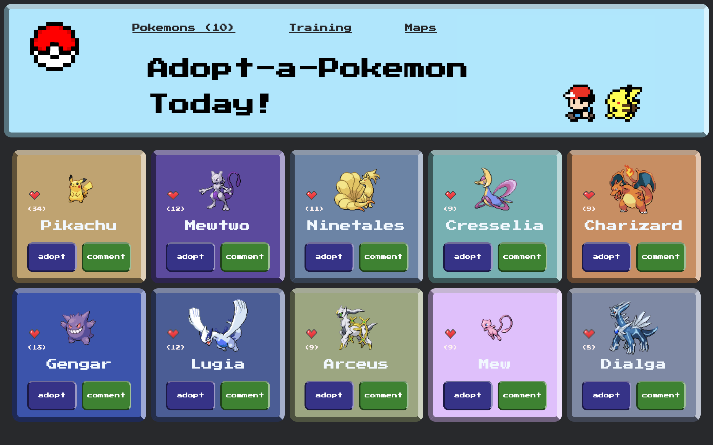

# Pokedex Capstone Project

This app is the capstone project we built at the end of our JavaScript module. It's a nostalgic interpretation of a pokedex, and we hope you enjoy it as much as we did putting it together. Go and catch 'em all!

## Screenshot

## Built With

- HTML 
- CSS 
- JavaScript
- Webpack 
- Jest

## Live Demo

[Live Demo Link](https://fabianofrank.github.io/pokemon-api/dist/)

[Live Video Link](https://fabianofrank.github.io/pokemon-api/dist/)

## Getting Started

To get a local copy up and running follow the instructions.

### Setup

1. Open the terminal and clone the project using `git clone git@github.com:fabianofrank/pokemon-api.git`

### Install

1. `cd` into the project folder and run `npm install`
2. Run the command `npm start`

### Usage

- Click on the heart to *Like* your favorite pokemon.
- Click on the comment button to see more information about the pokemon and share your experiences.
- Click on the adopt button to schedule an adoption appointment.
- Gotta catch 'em all!

### Run tests

1. Run the command `npm test`

## Authors

👤 **Oliver Coimbra**

- GitHub: [@oliverSCZ](https://github.com/oliverSCZ)
- Twitter: [@Olivercoimbra](https://twitter.com/Olivercoimbra)
- LinkedIn: [LinkedIn](https://www.linkedin.com/in/oliver-coimbra/)

👤 **Fabiano Frank**

- GitHub: [@fabianofrank](https://github.com/fabianofrank)
- Twitter: [@fabianofrankk](https://twitter.com/fabianofrankk)
- LinkedIn: [LinkedIn](https://www.linkedin.com/in/fabianofrank/)

👤 **Dante Alvarez**

- GitHub: [@danalvrz](https://github.com/danalvrz)
- Twitter: [@danalvrz](https://twitter.com/danalvrz)
- LinkedIn: [LinkedIn](https://www.linkedin.com/in/dante-álvarez-85098a222/)

## 🤝 Contributing

Contributions, issues, and feature requests are welcome!

Feel free to check the [issues page](../../issues/).

## Show your support

Give a ⭐️ if you like this project!

## Acknowledgments

- This website uses data from the free [Pokemon API](https://pokeapi.co/)

## 📝 License

This project is [MIT](./MIT.md) licensed.